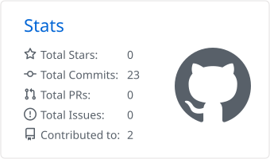
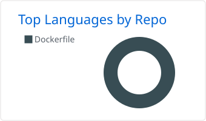
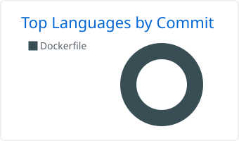

  

<h1 align="center">Артем</h1>

<b>Python backend developer</b>

  
  
  

  

---

### Стек

  
  
  
  
  
  
  
  
  

### Окружение

  
  
  

### GitHub

<picture>
  <source media="(prefers-color-scheme: dark)" srcset="./profile-summary-card-output/github_dark/3-stats.svg" />
  
</picture>

<picture>
  <source media="(prefers-color-scheme: dark)" srcset="./profile-summary-card-output/github_dark/1-repos-per-language.svg" />
  
</picture>
<picture>
  <source media="(prefers-color-scheme: dark)" srcset="./profile-summary-card-output/github_dark/2-most-commit-language.svg" />
  
</picture>

<picture>
  <source media="(prefers-color-scheme: dark)" srcset="https://raw.githubusercontent.com/wemnt/wemnt/output/snake-dark.svg" />
  
</picture>
